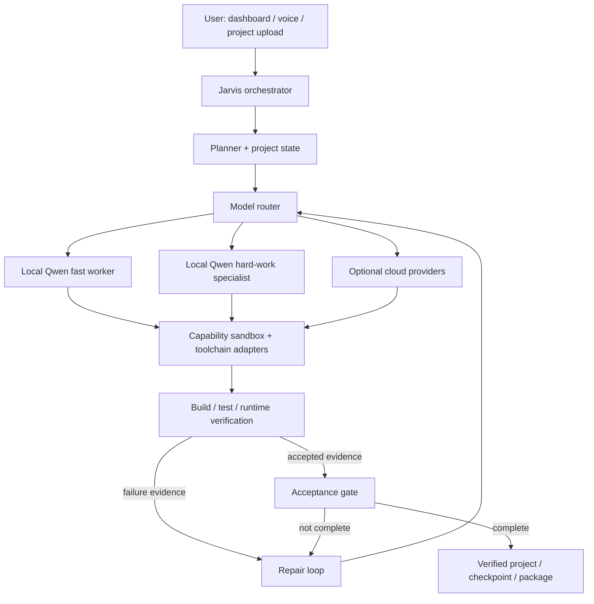

# Jarvis

Jarvis is an experimental, open-source, **Windows-first AI software builder and desktop assistant**. It is designed to plan, generate, repair, validate, checkpoint, and resume real software projects while remaining language-, framework-, and toolchain-agnostic.

The project is local-first: Jarvis can run with local Qwen models through llama.cpp, while also supporting optional cloud providers through provider adapters.

## What Jarvis is trying to solve

Most coding agents are good at producing files. Jarvis is being built around a harder goal: **keep working on a project until the code is actually buildable and functionally validated, without pretending that a mock, placeholder, or unverified workspace is complete.**

That means Jarvis tracks project state, chooses models, runs toolchains, diagnoses failures, proposes bounded repairs, validates candidate changes, rejects regressions, and saves resumable checkpoints when a project is not yet finished.

## Highlights

- **Universal project builder** — `project_builder_skills/` contains guidance for many languages, frameworks, engines, build systems, databases, mobile, desktop, web, and mixed repositories.
- **Evidence-driven repair loop** — candidate changes are validated with syntax, build, test, and runtime evidence before promotion.
- **Functional acceptance gates** — unresolved functional debt, missing workflow tests, broken builds, and protected regressions block final acceptance.
- **Checkpoint and resume** — incomplete projects can be saved and continued instead of regenerated from scratch.
- **AUTO hybrid local-model routing** — routine work can use a smaller local Qwen worker while harder architecture and repair work can be promoted to a larger specialist.
- **Strict manual model selection** — choosing a model manually locks the project to that model.
- **Multi-provider support** — optional Gemini/Hermes, OpenAI, and Anthropic provider paths are available alongside local Qwen.
- **Voice + dashboard command center** — browser dashboard, voice engine, one-click Windows launcher, optional Air Touch controls, project uploads, and diagnostics.
- **Local coding safety layer** — provider-driven edits are scoped to the selected project and validation mode restricts destructive commands.

## Architecture



The model is intentionally not the architecture. AUTO models share the same project state, skills, toolchain adapters, repair engine, validation evidence, and acceptance gates. Routing only changes which reasoning engine handles a call.

## Local model routing

The current AUTO router is designed around two local roles:

**9B worker**
- routine file generation
- local edits
- repetitive implementation
- straightforward first-pass repairs

**27B specialist**
- architecture planning
- ambiguous failure diagnosis
- dependency closure
- cross-component failures
- repeated repair families
- final convergence and acceptance reasoning

Manual model selection remains strict: if the user chooses a specific model, Jarvis uses that model exclusively for the project.

## Repair and acceptance philosophy

Jarvis follows a few core rules:

1. Do not call a project complete just because files exist.
2. Do not promote candidate edits until they survive validation.
3. Prefer compiler, test-runner, and runtime evidence over model confidence.
4. Preserve the best verified state instead of destroying working progress.
5. Keep the architecture stack-agnostic instead of overfitting to one language or framework.

The current V42.65 validation notes report **163 focused regression checks passed** across endgame recovery, cache isolation, model runtime behavior, adaptive I/O, connected functional repairs, durable progress, model protocol, and job lifecycle behavior.

## Quick start

> Jarvis is currently an active source release, not a polished installer.

### Clone

```powershell
git clone https://github.com/sbstoned/Jarvis.git
cd Jarvis
```

### Local Python runtime

The current command-center launcher expects:

```text
.venv\Scripts\python.exe
```

See `FULL_INSTALL_README.txt` and the included setup scripts for the current source-bundle workflow.

### Optional cloud providers

Jarvis is local-first. Cloud providers are optional.

To configure supported providers, run:

```powershell
.\CONFIGURE_AI_PROVIDERS.bat
```

Keep API keys and local provider configuration private. Files such as `ai_providers.env` are intentionally excluded from the public repository.

### Launch Jarvis

The primary Windows command-center launcher is:

```powershell
.\START_COMMAND_CENTER.bat
```

The launcher starts the local AI services, Jarvis backend components, voice engine, and dashboard according to the installed configuration.

## Project layout

Some of the main project areas are:

- `jarvis.py` — core Jarvis orchestration and assistant behavior.
- `local_qwen_project.py` — local Qwen project-building, repair, validation, and model-runtime logic.
- `project_builder_skills/` — stack-agnostic project-building knowledge and toolchain guidance.
- `ui/` — dashboard, web interface, Air Touch integration, and related UI components.
- `hardware_helper/` — source for optional hardware sensor integration.
- `START_COMMAND_CENTER.bat` — primary Windows startup entry point.
- `CONFIGURE_AI_PROVIDERS.bat` — optional cloud-provider configuration.
- `FULL_INSTALL_README.txt` — current source-installation documentation.
- `AI_PROVIDERS_README.txt` — provider architecture and configuration notes.

## Security and privacy

Jarvis is designed to keep machine-specific and sensitive data out of the public repository.

The repository excludes items such as:

- API keys and provider environment files
- local credentials and certificates
- runtime sessions and memory
- project uploads and generated project contents
- local model weights
- logs, caches, backups, and temporary files
- machine-specific build artifacts

Never commit credentials, API keys, passwords, private uploads, or local environment files.

Jarvis can execute local development commands, so generated or downloaded code should be treated as untrusted until it has been reviewed and validated.

## Contributing

Contributions are welcome, especially in areas such as:

- model routing and fallback behavior
- toolchain detection and sandboxing
- planning and project-state management
- repair-loop convergence
- acceptance and regression testing
- checkpoint and resume reliability
- dashboard and voice improvements
- cross-platform support
- broader language and framework coverage

Jarvis should remain general-purpose. Changes should avoid hard-coding assumptions around one language, framework, engine, or toolchain unless that behavior is isolated behind a stack-specific adapter.

See `CONTRIBUTING.md` for contribution guidelines.

## Project status

Jarvis is under active development. Interfaces, model-routing behavior, repair logic, setup steps, and internal architecture may change as the project evolves.

The current focus is improving autonomous project completion, repair convergence, model routing, validation quality, reproducible setup, and contributor-friendly open-source development.

## License

Jarvis is released under the MIT License.

See `LICENSE` for the full license text.
